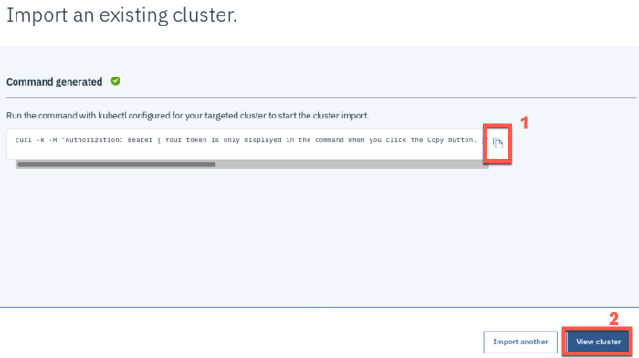
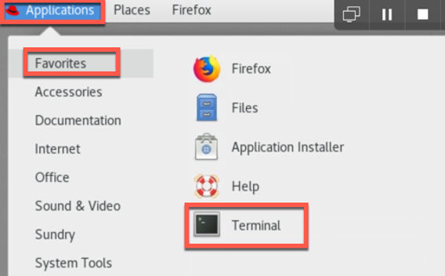

# Administracion de Clusters usando-IBM Cloud Pak for Multicloud Management

En este tutorial podrá explorar el CP4MCM, aprenderá cómo agregar un cluster, cómo desplegar una aplicación usando un Helm chart del catálogo y cómo administrar los objetos de definición en multiples clusters

## Requisitos para la realización:

- Cuenta de [IBM Cloud](https://cloud.ibm.com/registration)
- Reservar el ambiente de Skytap preparado en [IBM Demos](https://bluedemos.com/show/3490)

## :hand: Hands On!

1. Si el ambiente no inicia automáticamente, presiona el botón de iniciar en la esquina superior derecha. Espera alrededor de 15 minutos.


2. Selecciona CL1-Master para acceder al escritorio del servidor.


3. Un escritorio Linux aparecerá en una nueva pestaña del navegador. Para ajustar el tamaño del escritorio a su resolución presione el ícono como aparece en la imagen.


4. Ingrese con las credenciales. Usuario: `ibmuser`, Contraseña: `passw0rd`


5. Verifique que el ambiente este listo para ser utilizado. En el escritorio, deberá encontrar un ícono llamado Verify readiness. Presione doble clic para ejecutar el script encargado de verificar el estado del ambiente.


6. Se abrirá una ventana de Terminal en la que deberá ver el siguiente texto:


Si el ambiente no está listo, espere a que aparezca el mensaje "System ready".

7. Inicie el Navegador Firefox (enlace en el escritorio). Para visualizar mejor la página, cambie a modo pantalla completa en las opciones del navegador.


8. En la barra de marcadores podrá encontrar el enlace IBM Cloud Pak for Multicloud Management. Presione el enlace para acceder a la interfaz de usuario del Cloud Pak.


9. Ingrese las credenciales de acceso.

Usuario: `admin` Password: `Passw0rd`


10. Despues de ingresar, deberá visualizar la pantalla de Bienvenida. Si ve una pantalla distinta (Autenticación), presione nuevamente el bookmark IBM Cloud Pak for Multicloud Management.


## Añadir un Cluster. :package:

1. Para visualizar la información disponible de un cluster en su ambiente de administración, presione el menu (1) y seleccione **Automated Infraestructure -> Clusters** (2).


2. Aparecerá un cluster en la lista, este es el cluster local (hub cluster). Este cluster tiene tres nodos (2) y estado (1), además la versión de Kubernetes (4) y Klusterlet (3) entre otra información.


3. Usted puede añadir etiquetas para diferenciar los clusters. Para añadir etiquetas, presione los 3 puntos al final de la línea (1) y seleccione **Edit Labels** (2) de la lista deplegable.


4. Añada una nueva etiqueta, **datacenter** (1), con el valor **Raleigh** (2). Presione **+** (3) y **guardar** (4) los cambios.


5. Para añadir un nuevo cluster, presione el botón **Add Cluster**.


6. Usted puede añadir un cluster, importando un cluster existente o creando uno nuevo que utilice Cloud Automation Manager. En este caso usaremos la primera opción. Seleccionando **Import an Existing cluster** (1) y luego **Select** (2)


7. Damos un nombre (1) a nuestro cluster (Esto no cambiará el nombre real del cluster) y un namespace (2) para este cluster. Opcional: Puede ver el yaml que se genera y realizar los cambios que necesita (3). Para importar un cluster de OpenShift no necesita realizar cambios. Seleccione **generar comando** para continuar (4).


8. Un comando cURL aparecerá en pantalla, con el cual se añadirá el cluster. Presione en el botón copiar (1) y luego **Ver Cluster** (2) para ver la página de detalles del nuevo cluster administrado.



9. Necesita acceder a su cluster y ejecutar el comando anteriormete mencionado. Por medio de SSH puede realizar una conexión segura para ejecutar el comando usando el terminal.



10. El servidor donde está instalado el cluster tiene está configurado con DNS para facilitar la conexión, OCP. Realizar los siguientes commandos para acceder al servidor y conectarse al cluster.

```bash
ssh ocp
oc login -u admin -p passw0rd https://ocp.ibm.demo:8443
```


11. Pegue el comando generado en el [paso 8](#) (Edit -> Paste o puede utilizar Shift+Ctrl+V). Una vez ejecute el comando se crearan objetos Kubernetes y un namespace con el multicluster-endpoint.


**Nota**: Si recibe el error **_error: unable to recognize "STDIN": no matches for kind "Endpoint" in version "multicloud.ibm.com/v1beta1"_** vuelva a ejecutar el comando. Esto ocurre ya que no se encuentran preparados los objetos necesarios.

12. Puede ver el progreso usando el comando: `oc get pods -n multicluster-endpoint` <br>
    Asegurese de que todos los pods estén en el estado _Running_.


13. El endpoint del cluster estará listo cuando todos los Pods estén en el estado Running. Asimismo, en el navegador, podrá ver Ready como estado del cluster (Si es necesario actualice la página del cluster administrado).


14. En la página de Clusters, podemos ver el nuevo cluster administrado en la lista. Cambie las etiquetas para identificar el nuevo cluster, como aparece en la imagen.


15. Repita el [paso 4](#) para añadir una etiqueta con el nombre **environment**(1) con el valor **QA**(2). Presione **+**(3) y **Guardar**(4).


## Visualizar los clusters

1. Con IBM Cloud Pak for Multicloud Management usted puede administrar todos sus clusters desde un único panel de control. Por medio del Menú (1) seleccionando **Observar ambientes** (2) > **Overview** (3)


2. La opción Overview le mostrará el estado de todos los clusters incluyendo salud y métricas. En la parte superior vemos los detalles de operación a través de todos sus proveedores de nubes. En la primera sección, podrá ver información sobre los proveedores de nube, computación, aplicaciones e infraestructura.


3. En la sección inferior verá un resumen de los recursos. Podrá ver el estado del compliance del cluster, el estado, CPU, memoria y una vista del almacenamiento.


4. En el Menú, la página **topología**, nos da una representación gráfica de los clusters y la red asociada, aplicaciones y políticas. En la imagen se muestran los pasos para llegar a esta página.


5. Se mostrarán los dos clusters que tiene registrados para administración en el Cloud Pak. Seleccione el ícono **local-cluster (Demo)** para ver más detalles


6. De vuelta en la página de Topología, seleccione la pestaña **Networking**(1) y seleccione **local-cluster** (2), verá la topología y la información de red del cluster (3).


7. En la pestaña **Aplications** (1) seleccione **bookinfo-app** (2). En el área (3), podrá ver información sobre el despliegue de la aplicación.


## Despliegue de una aplicación a un cluster local o remoto.

1. En el **Menú** (1), seleccionamos **Administrar** (2) y luego **Helm repository** (3). Como aparece en la imagen.


2. En la página de Repositorios de Helm, registramos un nuevo repositorio presionando el botón **Add Repository**.


3. Escriba **coc-charts** en nombre de repositorio e ingrese https://ibm-icp-coc.github.io/charts/repo/stable como URL (2). Finalmente, **Agregar** (3).


4. Podrá ver, luego de unos segundos, **Completado** (1) en el estado de sincronización. Ahora desplegaremos una aplicación desde este nuevo repositorio Helm. Vamos al **cátalogo** (2), en la esquina superior derecha de la pagina, se abrira una lista de Helm Charts que puede desplegar.


5. Buscamos la aplicación de ejemplo que usaremos, **sum** (1), y seleccionamos **sumapp** (2).


6. Este chart despliega una aplicación web Liberty sencilla a modo de demostración. Presionamos **Configurar** para continuar


7. Ingresamos **mysum** como nombre (1), **default** como espacio de nombres (2) y seleccionamos las dos opciones, **local-cluster** y **managed-cluster** (3), en la opción Target cluster. Luego installamos (4) nuestra aplicación.


8. La instalación comencará inmediatamente pero toma unos minutos desplegar la aplicación a un cluster remoto. Puede ver el estado haciendo clic en **View Helm Releases**.


9. En la página, Helm Releases, podrá ver el despliegue del helm mysumapp en sus clusters.


10. En el Terminal podrá ver la creación de un nuevo pod con el nombre mysumapp.
    Comandos:

```bash
oc project default
oc get pods | grep mysumapp
```


11. Debemos definir una ruta para que nuestra aplicación se comunique con el exterior del cluster. Ejecutando el comando **`oc get services | grep mysumapp`** obtenemos el nombre del servicio asignado a nuestra aplicación.


12. Con el servicio, en este caso, _mysumapp-summapp-service_, exponemos una ruta hacía este servicio con el comando: **`oc expose service mysumapp-sumapp-service`**


13. La ruta la puede consultar usando el comando: **`oc get route | grep mysumapp`**


14. Utilizando la dirección resultante del comando anterior, http://mysumapp-sumapp-service-default.10.0.10.2.nip.io, en el navegador podemos ver el resultado de nuestro despliegue.


## Administrando los objetos dentro de un cluster

Con el Cloud Pak for Multicloud Management usted puede crear, administrar, ver detalles y resolver inconvenientes en los recursos de sus aplicaciones y objetos Kubernetes, a través de todos los clusters desde una interfaz única.

1. De vuelta en la pestaña de IBM Cloud Pak for Multicloud Management, presionamos el botón de búsqueda.


2. El menú de búsqueda le da acceso a una vista de los recursos y los objetos Kubernetes, como también una vista de las plantillas comunmente usadas; Cargas de trabajo, Pods que necesitan mantenimiento y recursos creados durante la última hora. Asimismo puede personalizar y crear su propia plantilla de búsqueda. Para este ejemplo usaremos la plantilla de **recursos creados durante la última hora**.


3. En la sección de Pods, podrá ver el pod llamado **mynode-nodejssample-nodejs** que creamos anteriormente, lo seleccionamos.


4. Veremos el archivo de definición YAML de nuestro Pod, desde donde podremos editarlo, como también la pestaña Logs donde veremos los reportes dirigidos al STDOUT por nuestras aplicaciones contenidas en el pod. **Nota**: esto lo puede realizar con cualquier cluster que tenga registrado en el Cloud Pak.

## Información Adicional

Para más información acerca del IBM Cloud Pak for Multicloud Management, visitar: https://www.ibm.com/cloud/cloud-pak-for-management

### Autores:

Equipo IBM Cloud Hybrid Integration Colombia


